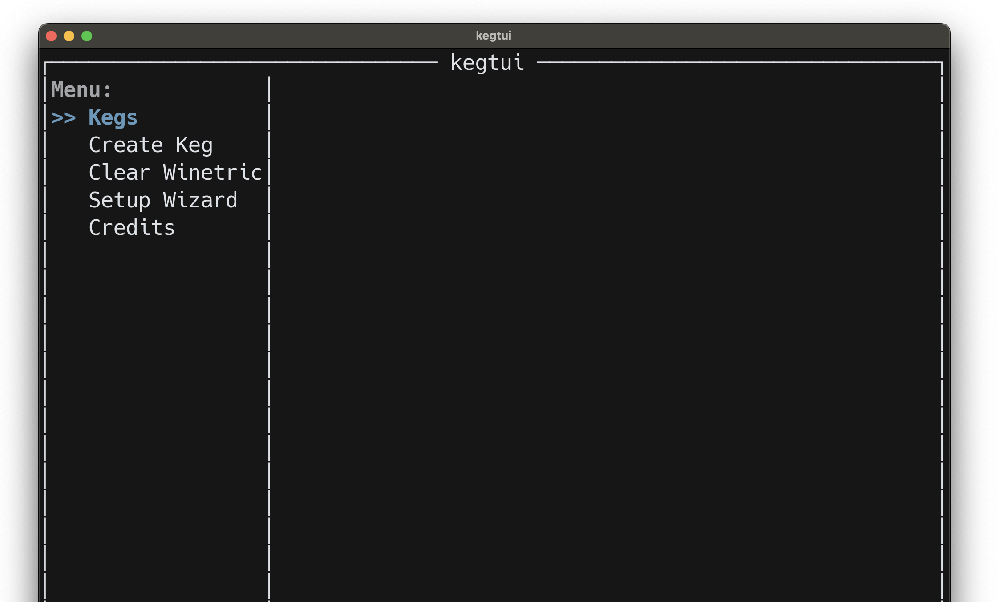

# kegtui

> [!WARNING]
> kegtui does **NOT** create wrappers or engines or claim legal rights to them. kegtui is **NOT** a substitute for using [Kegworks][kegworks] to obtain wrappers or engines. However, kegtui can assemble wrappers and engines into a keg.

Terminal interface for [Kegworks][kegworks].

## Download

[](https://github.com/ethanuppal/kegtui/releases)

### First-time setup

After clicking on this button and downloading, you'll have to open it by right-clicking on it from Finder:


Subsequent opens won't require this step.

If you drag the app into your Applications folder, you can open it via Spotlight.

> [!TIP]
> If you get an alert saying that the `.app` is damaged, run the following command:
> ```bash
> xattr -d com.apple.quarantine <path/to/kegtui.app>
> ```
> Now you can open the app without issues.

## Usage

Press `?` anywhere to view keybinds.

### Setup

Once you've opened the app, you'll see a bunch of options:



1. Run the setup wizard.
2. Create a new keg using the wrapper and engine downloaded from the setup wizard. If you don't see them, quit and reopen the app.
3. Now, go to the kegs section. If you don't see your new keg, quit and reopen the app.
4. Install Steam via winetricks. You can do this via kegtui by choosing `Winetricks` and then uncommenting the line starting with `# steam.app = `. Then, save and quit the file. The winetricks file will be opened by default in your `$EDITOR`; if you didn't define this, it'll open in plain Vim.
5. Verify that Steam is installed by choosing `Open C Drive` and navigating to the steam installation folder in `Program Files (x86)`.
5. Once Steam is installed, choose `Edit Config` and set the program path to `"/Program Files (x86)/Steam/Steam.exe"`.
6. Finally, you should be able to `Launch` the wrapper and use Steam as normal.
<!-- 3. Open kegtui, navigate to the wrapper you just created, and `Launch` it. If all goes well, you should see the Kegworks GUI config menu open. Close this window once it has opened. Back in kegtui, run `Kill Processes`. -->

Remember to exit Steam by selecting `Kill Processes` in kegtui when you're done --- this is the equivalent of doing `Cmd-Shift-K` in Whisky.

> ![NOTE]
> If you use a different shell than the native shell, you'll have to configure it in the environment.
> See the "Config" section for more information.

## Config

### Core App

See [the definition of the config file](./core/src/app_config.rs).
It is located at `$XDG_CONFIG_HOME/kegtui.toml`.

### Wrapper

There is experimental configuration using the Debug Config menu at the bottom of the app.
These are the options for the environment:

- `KEGTUI_HIDE_EXTRA_UI=1` hides this debug UI (you can still make config changes from the Application Support folder)
- `KEGTUI_FONT_SIZE` changes the font size
- `KEGTUI_EXIT_ON_TERMINAL_SHUTDOWN=0` does not quit the app if the terminal shuts down
- `SHELL` overrides `zsh` as the shell environment used

The font config file is just the name of a font you have installed on your computer.

## Support [GCenx](https://github.com/Gcenx) / [Kegworks][kegworks].

Wine on macOS is effecivtively made possible by him.
Please support him in any way possible!

- https://paypal.me/gcenx
- https://ko-fi.com/gcenx

[kegworks]: https://github.com/Sikarugir-App/Sikarugir
